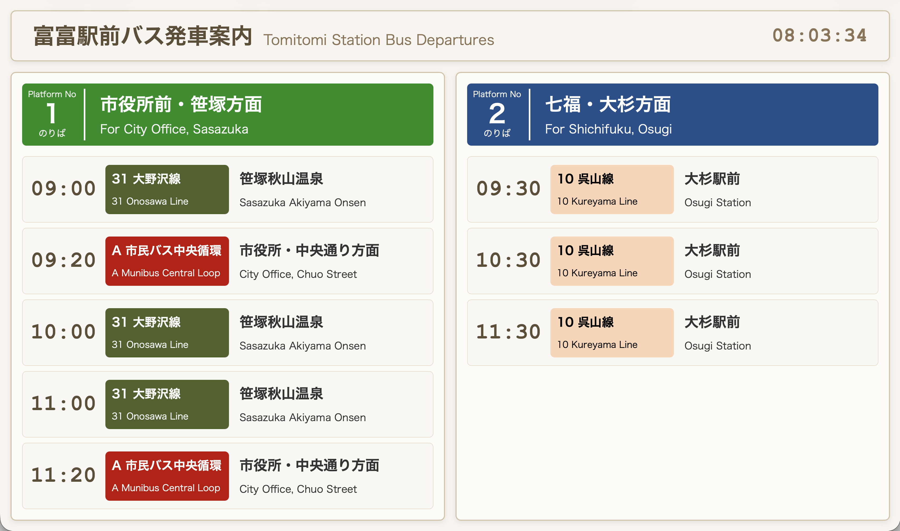

# Open Bus Signage

GTFSファイルを利用し、Webブラウザでバス発車案内のデジタルサイネージを表示するプロジェクトです。
複数の事業者のGTFSファイルを取り込み、１つのサイネージにまとめて表示できます。

## 構成

- 設定: [config/gtfs_config.json](config/gtfs_config.json)
- 前処理スクリプト: [src/python/preprocess_gtfs.py](src/python/preprocess_gtfs.py)
- Web UI:
  - [src/web/index.html](src/web/index.html)
  - [src/web/styles.css](src/web/styles.css)
  - データローダー: [src/web/js/signage-data-loader.js](src/web/js/signage-data-loader.js)
  - アプリ本体: [src/web/js/signage-app.js](src/web/js/signage-app.js)
- ビルド: [scripts/build.js](scripts/build.js)
- 出力データ: [output/signage_data.json](output/signage_data.json)

## セットアップ

- Node.js 14以上と Python 3.9+ を用意してください。
- 依存関係
  - Node: [package.json](package.json) を参照
  - Python: pandas, partridge

## 使い方

1. GTFS設定を編集
   - [config/gtfs_config.json](config/gtfs_config.json)
   - 出力先は `"output/signage_data.json"` を使用しています
   - 参照するGTFSファイルを用意します

2. 前処理の実行

   ```sh
   python src/python/preprocess_gtfs.py -c config/gtfs_config.json
   ```

3. ビルドと起動
   ```sh
   npm run build
   npm run serve:dist
   ```

## 実行例



## ライセンス

MIT License

## クレジット

- Author: Kenichi Higashide
